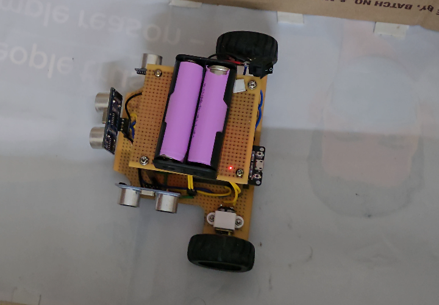

# ESP32 Ultrasonic Maze Solver 🤖

An autonomous **obstacle-avoiding maze-solving robot** built on an **ESP32**, navigating using three **HC-SR04 ultrasonic rangefinders** (left / front / right). A reactive **state-based controller** converts continuous distance readings into discrete wall states and drives a **finite-state navigation policy** with real-time Bluetooth Serial telemetry.

  
   
  <em>▶️ Click the image to watch the demo on YouTube</em>

---

## ✨ Highlights

- **Three-sensor ultrasonic perception** — left / front / right HC-SR04 array
- **Discretized world model** — continuous range → binary wall states via threshold (15 cm)
- **Reactive FSM** — Forward / Adjust-Left / Adjust-Right / Full-Block-Stop
- **Pivot-turn correction loop** — bot rotates until front sensor clears wall
- **Live telemetry over Bluetooth Serial** for in-field debugging without USB tether
- **Hardware PWM** via ESP32 LEDC for smooth speed control on the TB6612FNG driver
- Echo timeout handling (treats `pulseIn` timeouts as "no wall" instead of garbage data)

---

## 🛠️ Hardware

| Component              | Part                          |
| ---------------------- | ----------------------------- |
| MCU                    | ESP32 DevKit V1               |
| Range Sensors          | HC-SR04 (×3 — L / F / R)      |
| Motor Driver           | TB6612FNG dual H-bridge       |
| Motors                 | N20 geared DC motors (×2)     |
| Power                  | 2S Li-ion 7.4 V               |
| Regulator              | LM2596 buck (7.4 V → 5 V)     |

---

## 🧠 Navigation Logic

The continuous distance from each sensor is thresholded into a binary "wall present" state, giving a 3-bit world descriptor `[L, F, R]`. The controller is a reactive FSM:

| State `[L F R]` | Action            | Behavior                                    |
| --------------- | ----------------- | ------------------------------------------- |
| `0 0 0`         | **Forward**       | Open corridor — cruise straight             |
| `1 0 0`         | **Adjust Left**   | Pivot left until front clears               |
| `0 0 1`         | **Adjust Right**  | Pivot right until front clears              |
| `1 1 1`         | **Stop**          | Dead-end — full block                       |
| *otherwise*     | Forward (default) | Conservative fallback                       |

---

## 📡 Telemetry

Bluetooth Serial (device name: `MazeBot_Logic_Update`) streams state transitions in real time. Pair from a phone Bluetooth terminal app to watch decisions live.

---

## 🚀 Future Work

- Replace reactive FSM with **flood-fill** or **DFS-with-backtracking** for true shortest-path maze solving
- Add **wheel encoders** for closed-loop odometry
- Migrate sensor stack to **VL53L0X ToF** for tighter, faster ranging
- Custom **KiCad PCB** integrating ESP32, TB6612FNG, and sensor headers

---

## 🏷️ Topics

